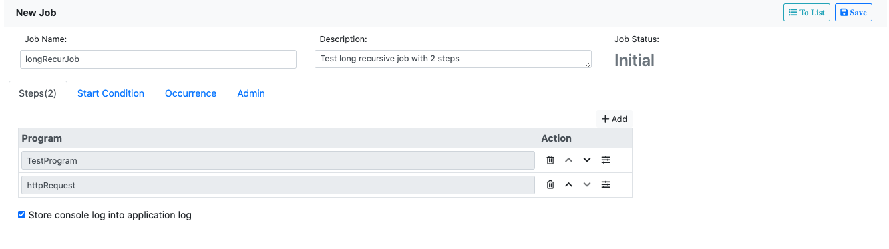
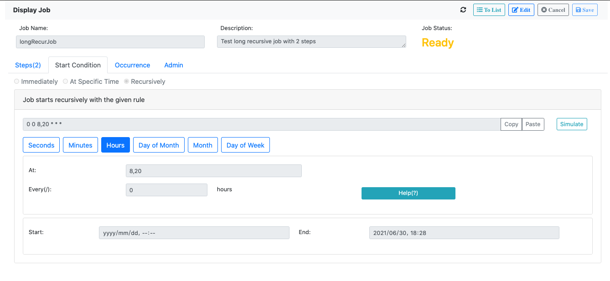

# Node Background Job

Node background job is a job server which allows you to schedule Node.js scripts. 
It is not just for the developers, but more for the end users.

## Features
* Web UI for job defining, scheduling, and monitoring.
* Support 3 different job modes: Immediately, Specific-time, and Recursively.
* Job program can be defined with dynamic parameters, application logs, and outputs.
* Multiple steps can be defined in a single job.
* With/without DB as persistence. 
* Recover from the job server restarting.

## Example
You may experience yourself in this [Live Demo](https://darkhouse.com.cn/job/jobs).

In the job list page, you can search the existing jobs.
Click `New` to create a new Job.


In the first tab "Steps", you can add steps. 
A job step is defined from a job program and its parameters.
While job program is developed using node.js, and then registered in the job server.


You can add multiple steps, and they will be executed in sequence.
Check "Store console log into application log" will store the `console.log()`
information to the job application log.


In the second tab "Start Condition", you can define the job to one of the 3 modes:
1. *Immediately*: the job will be executed immediately after scheduled.
2. *At Specific Time*: the job will be executed at a specific time. 
3. *Recursively*: the job will be executed recursively based on [Cron](https://www.gnu.org/software/mcron/manual/html_node/Crontab-file.html).

The cron expression in the below example means the job will be executed in every minute 
starting from current to the given end time.


Once you saved and scheduled the job, 
the job occurrences will be generated and shown in the "Occurrence" tab.
You can search and filter the occurrences with statuses and timespan. 
In the occurrence detail, you can check the application logs and the output. 


## To Begin

1. Install it:
   ```bash
    $ npm install node-background-job --save
   ```
2. Copy the content in `node_modules\node-background-job\app\job` to `app\job`.
   The content is the compiled web UI for the job server.    
   
3. Create a job program and register it for testing purpose.
   ``` javascript
   import { JobProgram } from "node-background-job";
   
   export default class TestProgram extends JobProgram {
     async run(applicationLog) { // Job application log
       console.log("start running testJobProgram...");
       return new Promise( (resolve, reject) => {
         setTimeout( () => {
           console.log(this.name, this.parameters);
           if (this.parameters.PARAM1 === 'value1'){
             applicationLog.info('application log 1');
             reject(new Error('error happened in testJobProgram'));
           } else {
             console.log('testJobProgram finished!');
           }
           resolve(this.name);
         }, 500);
       })
     }
   }
   
   JobProgram.registerJobProgram('TestProgram', {
     className: 'TestProgram',
     class: TestProgram,
     description: {
       DEFAULT: 'Test job program',
       EN: 'Test job program'
     },
     parameterDefinitions: {
       GROUP1: {
         text: 'Group One',
         parameters: {
           PARAM1: {
             type: 1,
             text: 'Parameter 1',
             mandatory: true,
           },
           PARAM2: {
             dataElement: 'USER_ID',
           }
         }
       }
     }
   });
   ```
4. Create a `server.mjs` in your project root folder:
   ``` javascript
   // Create a expressjs app
   import express from 'express';
   const app = express();
   
   // Register your Angular built files as static
   import * as path from 'path';
   import { fileURLToPath } from 'url';
   const __filename = fileURLToPath(import.meta.url);
   const __dirname = path.dirname(__filename);
   app.use(express.static(path.join(__dirname, 'app')));
   app.get('/', (req, res) => { // The default index.html
     res.sendFile(path.join(__dirname, 'app/job/index.html'));
   });
   
   // Allow compression and json parser
   import compression from 'compression';
   app.use(express.json());
   app.use(compression());
   
   // Route to the job web UI
   router.get('/job/*', (req, res) => {
     res.sendFile(path.join(__dirname, 'app/job/index.html'));
   });
   app.use('/', router);
   
   // Import the job programs
   import TestProgram from "./server/jobPrograms/testProgram.mjs";
   
   // Bootstrap the server
   Scheduler.getPreviousPIDs()
     .catch( errors => console.error(errors))
     .then((prevNumNodes) => {
       process.env.previousPID = Scheduler.previousPIDs[0];
       Scheduler.on()
         .then( () => {app.listen(process.env.PORT || 3000, () => console.log('Example app listening on port 3000!'));})
         .catch( error => console.error(`PID ${process.pid}: `, error.message || error));
     });
   ``` 
5. Start the job server:
   ```bash
   $ node server.mjs
   ```   
6. If you want to use the DB persistence,
   then you should install the [json-on-relations](https://github.com/VinceZK/json-on-relations/wiki/Setup).
   (You can ignore the step 3 to avoid establish a jor server).
   The main benefit is to allow recovering from the job server restarting.
   
   Start the job server:
   ```bash
   $ node server.mjs JOB_SERVER=server1; USE_DB=true
   ```   
    
## License
[The MIT License](http://opensource.org/licenses/MIT)
   
