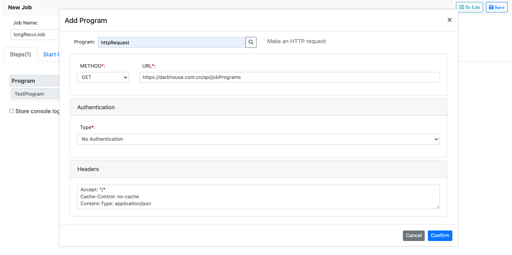
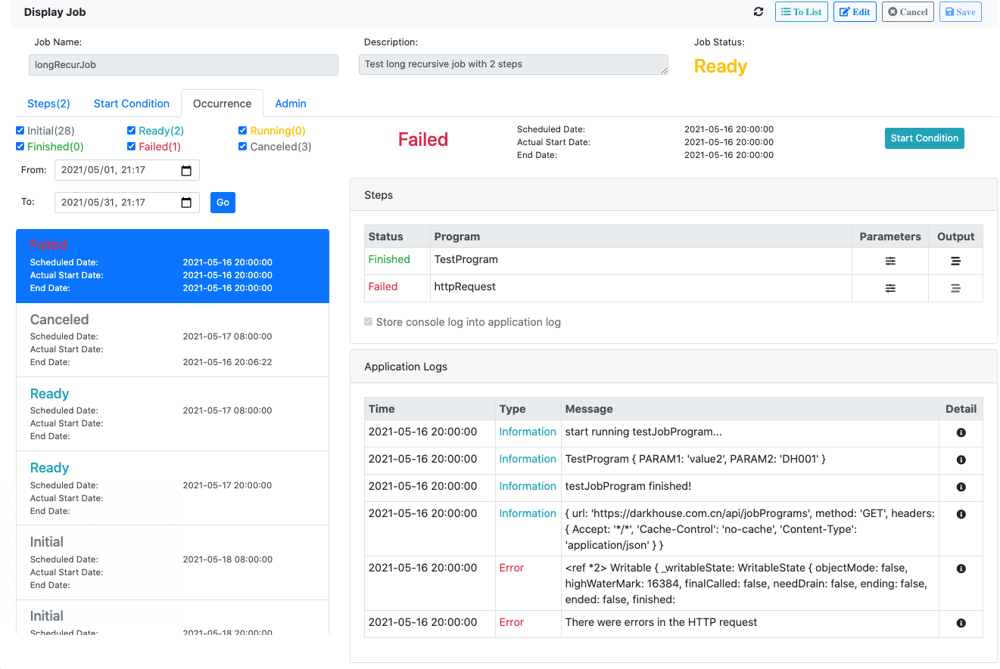

# Node Background Job

Node background job is a job server which allows you to schedule Node.js scripts. 
It is not just for the developers, but more for the end users.

## Features
* Web UI for job definition, scheduling, and monitoring.
* Support 3 different job modes: Immediately, Specific-time, and Recursively.
* Customize job programs with flexible parameters.
* Multiple steps can be defined in a single job.
* Application logs and outputs can be checked and persisted.
* With/without DB as persistence. 
* Recover from the job server restarting.

## Example
You may experience yourself in this [Live Demo](https://darkhouse.com.cn/job/jobs).

In the job list page, you can search the existing jobs.
Click `New` to create a new Job.


In the tab "Steps", you can add steps. 
A job step is defined from a job program and its parameters.
The job program is pre-developed and registered in the job server.


You can add multiple steps, and they will be executed in sequence.
Check "Store console log into application log" will store the `console.log()`
information into the job application log.


In the second tab "Start Condition", you can define the job in one of the 3 modes:
1. *Immediately*: the job will be executed immediately after scheduled.
2. *At Specific Time*: the job will be executed at a specific time in future. 
3. *Recursively*: the job will be executed recursively based on [Cron](https://www.gnu.org/software/mcron/manual/html_node/Crontab-file.html).

The cron expression in the below example means the job will be executed in 8:00 and 16:00 every day
starting from now to the given end time.


Once you saved and scheduled the job, 
the job occurrences will be generated and shown in the "Occurrence" tab.
You can search and filter the occurrences with statuses and timespan. 
In the occurrence detail page, you can check the application logs and the output of the occurrence run. 


## To Begin

1. Install it:
   ```bash
    $ npm install node-background-job --save
   ```
2. Copy the content in `node_modules\node-background-job\app\job` to `app\job`.
   The content is the compiled web UI for the job server.    
   
3. Create a job program and register it for testing purpose. 
   This is an optional step. You can also use the pre-delivered job programs: [httpRequest](server/jobPrograms/httpRequest.js).
   ``` javascript
   import { JobProgram } from "node-background-job";
   
   // Extend the super class JobProgram
   export default class TestProgram extends JobProgram {
     async run(applicationLog) { // Redefine the method run
       console.log("start running testJobProgram...");
       return new Promise( (resolve, reject) => {
         setTimeout( () => {
           console.log(this.name, this.parameters);
           if (this.parameters.PARAM1 === 'value1'){
             applicationLog.info('application log 1');
             reject(new Error('error happened in testJobProgram'));
           } else {
             console.log('testJobProgram finished!');
           }
           resolve(this.name);
         }, 500);
       })
     }
   }
   
   // Register the job program
   JobProgram.registerJobProgram('TestProgram', {
     className: 'TestProgram',
     class: TestProgram,
     description: {
       DEFAULT: 'Test job program',
       EN: 'Test job program'
     },
     parameterDefinitions: {
       GROUP1: {
         text: 'Group One',
         parameters: {
           PARAM1: {
             type: 1,
             text: 'Parameter 1',
             mandatory: true,
           }
         }
       }
     }
   });
   ```
4. Create a `server.mjs` in your project root folder:
   ``` javascript
   // Create a expressjs app
   import express from 'express';
   const app = express();
   
   // Register your Angular built files as static
   import * as path from 'path';
   import { fileURLToPath } from 'url';
   const __filename = fileURLToPath(import.meta.url);
   const __dirname = path.dirname(__filename);
   app.use(express.static(path.join(__dirname, 'app')));
   app.get('/', (req, res) => { // The default index.html
     res.sendFile(path.join(__dirname, 'app/job/index.html'));
   });
   
   // Allow compression and json parser
   import compression from 'compression';
   app.use(express.json());
   app.use(compression());
   
   // Route to the job web UI
   import { Scheduler, router, HttpRequest } from 'node-background-job';
   // In case you want use DB persistence, uncomment below 2 lines.
   // import * as jor from 'json-on-relations';
   // router.use(jor.Routes);
   router.get('/job/*', (req, res) => {
     res.sendFile(path.join(__dirname, 'app/job/index.html'));
   });
   app.use('/', router);
   
   // Import the job programs
   import TestProgram from "./server/jobPrograms/testProgram.mjs";
   
   // Bootstrap the server
   Scheduler.getPreviousPIDs()
     .catch( errors => console.error(errors))
     .then((prevNumNodes) => {
       process.env.previousPID = Scheduler.previousPIDs[0];
       Scheduler.on()
         .then( () => {app.listen(process.env.PORT || 3000, () => console.log('Example app listening on port 3000!'));})
         .catch( error => console.error(`PID ${process.pid}: `, error.message || error));
     });
   ``` 
5. Start the job server:
   ```bash
   $ node server.mjs
   ```   
6. If you want to use the DB persistence,
   then you should install the [json-on-relations](https://github.com/VinceZK/json-on-relations/wiki/Setup)
   (You can ignore the step 3).
   The main benefit is to allow recovering from the job server restarting.
   
   Start the job server:
   ```bash
   $ node server.mjs JOB_SERVER=server1; USE_DB=true
   ```   
   
## httpRequest 

The job program `httpRequest` is pre-delivered which allows you schedule jobs that can raise http requests.
This is an easy way to achieve a job scheduler if your business logic has already been exposed as web services. 


However, this program cannot be compared with [Postman](https://www.postman.com/).
Be aware of the following limitations:
1. The http methods are limited to 'GET', 'POST', 'PUT', 'PATCH', and 'DELETE'.
2. Authentication now only supports the basic authentication. 

Nevertheless, it is not a recommended approach as it cannot monitor the job status, 
check the application logs, and read the outputs in an integral way. 
In practice, orchestration in multiple actions is very usual.
For example, you may have a process like this: 
first authentication, then you execute action1; based on the outputs of action1, you execute action2, and thereafter. 
Thus, it is not realistic for a solution like combination of http calls. 

It is much recommended you write your own job programs,
in which you orchestrate multiple actions. 
Then [httpRequest](server/jobPrograms/httpRequest.js) is a good reference. 
Besides you write your logic by redefining the method `run`, you should define the parameters. 
The following specification describes how the parameters are defined and rendered on the UI. 
 ```js
// Parameter definitions
parameterDefinitions: {

  // A unique group ID
  GROUP1: {
    // Label text of the group. Using language codes to support multiple languages
    text?: {DEFAULT: 'text of group1', EN: 'text of group1', ZH: '组1'},

    // How is the group rendered in the UI.
    // Allowed values are 'block' and 'row'.
    // 'block' means the parameters in this group will be displayed in block.
    // 'row' means all the parameters are lined in a row. In this case, the group label won't be shown.
    displayIn?: 'block', // default 'block'

    // Definition of the parameters
    parameters: {
      // A unique parameter name
      PARAM_NAME: {
        // The data type of the parameter
        // Allowed values are '1: char', '2: integer', '3: boolean', '4: decimal', '5: string', '6: binary', '7: date', '8: timestamp'
        type?: 1, // default '1: char'

        // Allowed values for the parameter. If domain is provided, the parameter will be rendered as dropdown box
        // Description of a value supports multiple languages
        domain?: {
          value1: {DEFAULT: 'Label1'}, // multiple language representation
          value2: 'label2' // simple string
        },

        // Regex to validate the parameter value
        pattern?: '',

        // Label text of the parameter, supports multiple languages
        text?: {DEFAULT: 'Label1'},

        // The default value of the parameter
        defaultValue?: '',

        // How is the parameter rendered
        // Allowed values are 'input', 'dropdown', 'checkbox', 'text', 'password', 'date', and 'datetime'.
        displayAs?: 'input',  // default 'input'

        // If json-on-relation is used, then data element can be assigned.
        // If attributes like type, domain, text, defaultValue and displayAs are provided, then they will override the settings in the data element.
        dataElement?: 'DATA_ELEMENT',

        // Control whether the parameter is mandatory
        mandatory: true,

        // Control whether the parameter is readonly
        // Besides given a boolean value, an expression can be provided.
        // For example, if the string "parameters.TYPE === 'GET'" is provided, then during runtime, 
        // whether this parameter is readonly or not depends on the value of parameter TYPE.
        readOnly?: false,

        // Control whether the parameter is hidden or shown.
        // Besides given a boolean value, an expression can be provided
        hidden?: false,

        // How many columns are spanned for the parameter. The total number of columns is 12.
        columnSpan?: 2,  // From 1~12, default 12

        // Whether to hide the label
        hideLabel?: false
      }
    }
  }
}
 ```

## License
[The MIT License](http://opensource.org/licenses/MIT)
   
